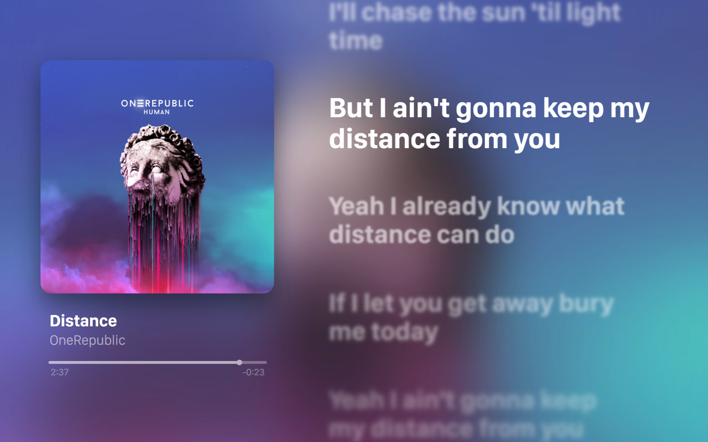
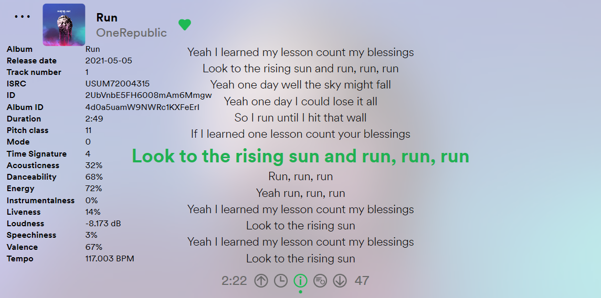
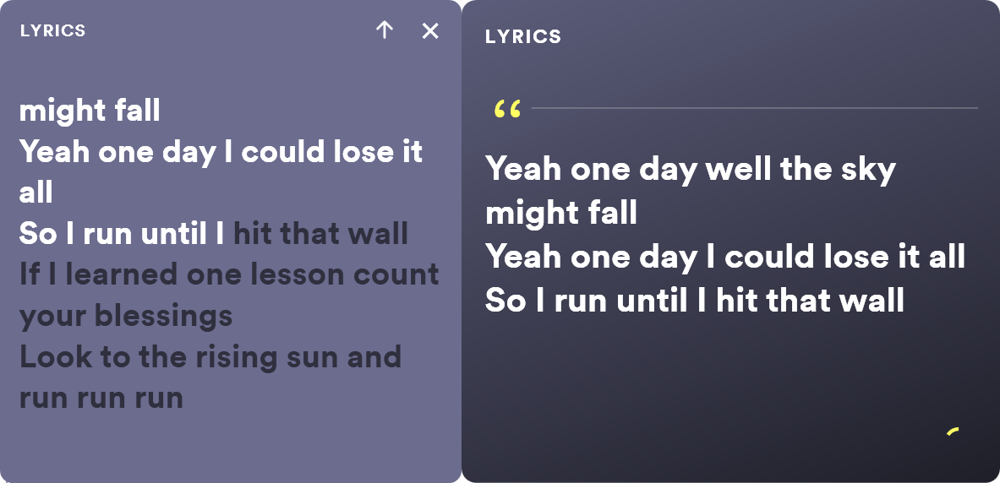

# Lyricify-App
A fantastic app to provide auto-scrolling lyrics for [Spotify](https://www.spotify.com), [iTunes](https://music.apple.com), [Music Center](https://www.sony.com/electronics/support/articles/MC4PC020001), [QQ Music](https://y.qq.com), [Netease Cloud Music](https://music.163.com), and [YesPlayMusic](https://github.com/qier222/YesPlayMusic).  
一款为 Spotify、iTunes、Music Center、QQ 音乐、网易云音乐、YesPlayMusic 提供滚动歌词的软件。

Welcome to share feedbacks and suggestions. You can make contributions by translating Lyricify into more languages, xaml files are in https://github.com/WXRIW/Lyricify-App/tree/main/i18n .  
欢迎反馈 bug 和建议！你可以通过把 Lyricify 翻译成更多语言来做贡献。

### Coming 2022
新的一年，新的 Lyricify！  



**Reserved Download Link / 备用下载地址:**  
https://wxriw.lanzoux.com/b015qcwob

**Wrong Lyrics Feedback / 错误歌词反馈:**  
https://github.com/WXRIW/Lyricify-App/issues/4

**Telegram Group / Telegram 群:**  
https://t.me/lyricify

**Telegram Channel / Telegram 频道:**  
https://t.me/lyricifyreleases

**QQ Group / QQ 群:**  
[点击链接加入群聊【Lyricify 用户群】（群号：972282479）](https://jq.qq.com/?_wv=1027&k=hZG8VRV4)

**Go to [Lyricify Wiki](https://github.com/WXRIW/Lyricify-App/wiki), learn more about Lyricify.**  
**更多相关使用说明，详见 [Lyricify Wiki](https://github.com/WXRIW/Lyricify-App/wiki) ！**   

**"Android Lyricify" Lyricist / “安卓版 Lyricify” Lyricist:**  
https://github.com/Lyricify/Lyricist-App   





## Lyricify Startup Arguments / Lyricify 启动参数
### Get From / 获取
```
Usage:  
  Lyricify.exe -g getfrom  
  getfrom:  
    0: Spotify (No Login)  
    1: QQ Music  
    2: Netease Cloud Music (or YesPlayMusic)  
    3: Music Center  
    4: iTunes  
Example:  
  Lyricify.exe -g 0
```

### Font / 字体
```
Usage:  
  Lyricify.exe -font font  
  font:  
    sf: San Francisco  
    segoe: Segoe UI
  There are more for you to discover!  
Example:  
  Lyricify.exe -font sf
```
