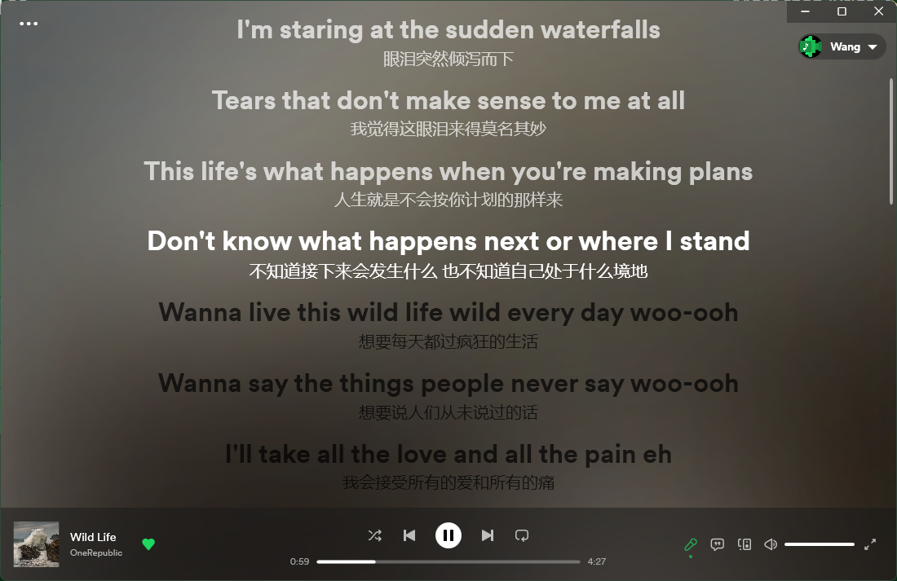
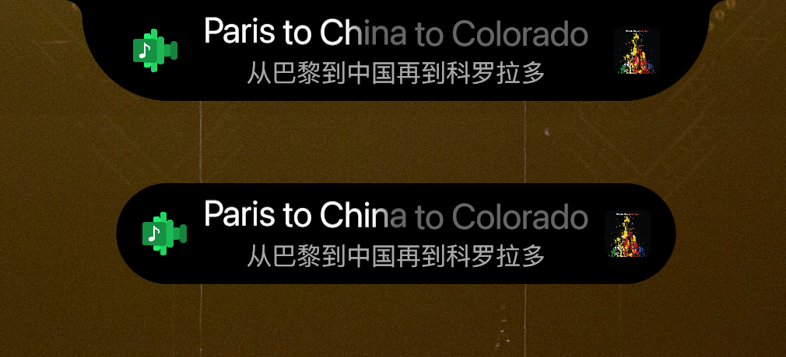
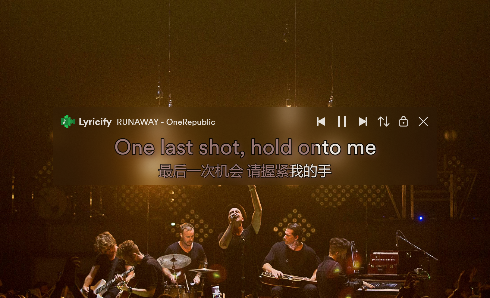
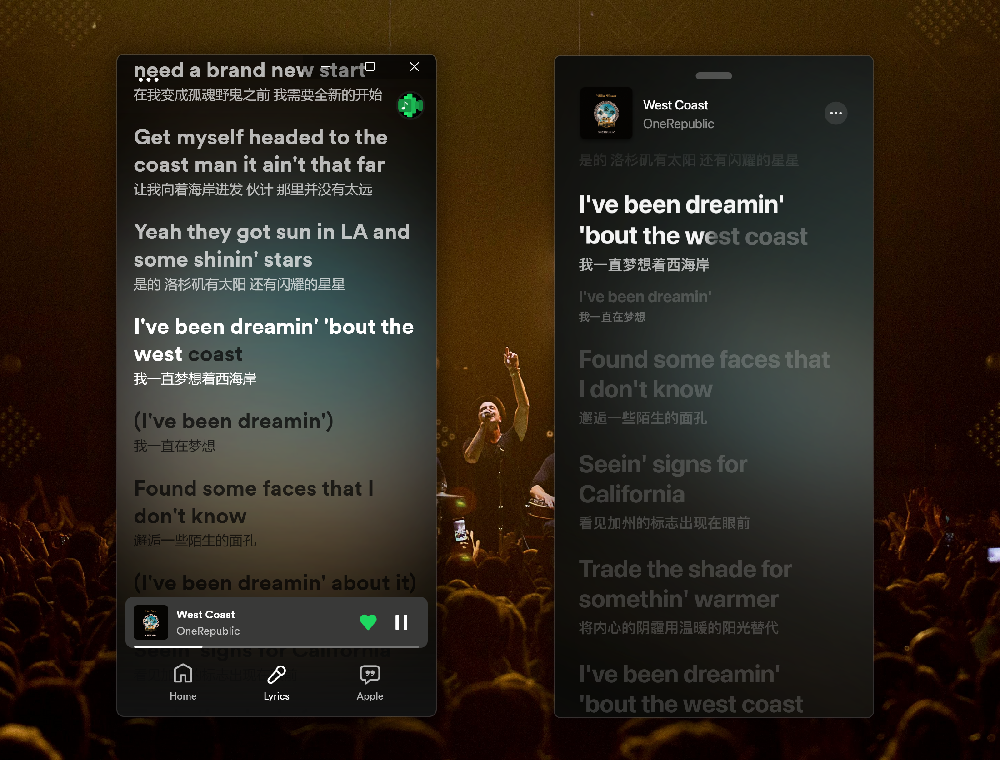
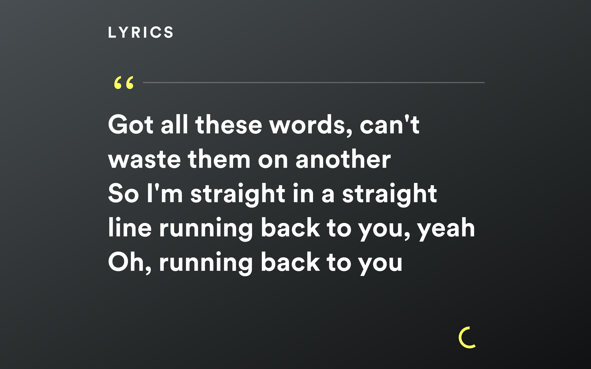
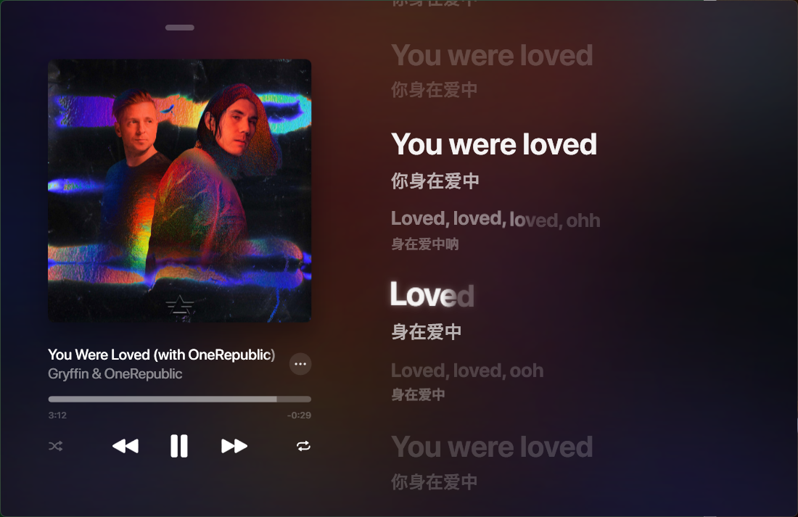

# Lyricify App

| 软件 Application | 最新版本 Latest Version | 备注 Notes | 平台 Platform | 使用指南 User Guide |
| :-: | :-: | :-: | :-: | :-: |
| [Lyricify 4](https://github.com/WXRIW/Lyricify-App#lyricify-4) | [4.2.12-release](https://github.com/WXRIW/Lyricify-App/releases/tag/v4.2.12) | 适用于 Spotify 用户 For Spotify users | Windows | [点击查看 Click to view](/docs/Lyricify%204/README.md)<a href="#ref2_en">2</a> |
| [Lyricify Mobile](https://github.com/WXRIW/Lyricify-App#lyricify-mobile) | [1.4.2-release](https://github.com/WXRIW/Lyricify-App/releases/tag/mobile-v1.4.2) | 适用于 Spotify 用户 For Spotify users | Android, iOS, iPadOS, macOS<a href="#ref3">3</a>, Windows | [点击查看 Click to view](/docs/Lyricify%20Mobile/README.md)<a href="#ref2_en">2</a> |
| [Lyricify 3](https://github.com/WXRIW/Lyricify-App#lyricify-3) | [3.8.6-release](https://github.com/WXRIW/Lyricify-App/releases/tag/v3.8.6) | 适用于 Spotify、iTunes 等<a href="#ref1">1</a> 的用户 For Spotify, iTunes and more apps<a href="#ref1_en">1</a>' users | Windows | [点击查看 Click to view](/docs/Lyricify%203/README.md)<a href="#ref2_en">2</a> |

**备注**  
1. Lyricify 3 目前支持 Spotify、iTunes、Apple Music、Music Center、QQ 音乐、网易云音乐、YesPlayMusic，建议 Spotify 用户使用 Lyricify 4，不要使用 Lyricify 3。  
2. Lyricify 4、Lyricify 3 均可以借助 Wine 实现在 Linux 上运行。Lyricify 4 实现过程可能会比较繁琐，需要您耐心尝试。  
3. Lyricify Mobile for macOS 因为一些问题暂时未发布，预计随 1.4.3 发布，敬请期待。  

**Notes**  
1. Lyricify 3 currently supports Spotify, iTunes, Apple Music, Music Center, QQ Music, Netease Cloud Music, YesPlayMusic, we suggest all Spotify users to use Lyricify 4, instead of Lyricify 3.  
2. User guide documents are in Simplified Chinese, use a translator if you don't speak Chinese.  

**Telegram Group / Telegram 群:**  
https://t.me/lyricify

**Telegram Channel / Telegram 频道:**  
https://t.me/lyricifyreleases

**QQ Group / QQ 群:**  
[点击加入群聊【Lyricify 用户群 1】](https://jq.qq.com/?_wv=1027&k=hZG8VRV4)（群号：972282479）  
[点击加入群聊【Lyricify 用户群 2】](https://jq.qq.com/?_wv=1027&k=l0Sy2aGi)（群号：653663090）  
[点击加入群聊【Lyricify 用户群 3】](https://jq.qq.com/?_wv=1027&k=nUr4jHVU)（群号：515098369）  

**Reserved Download Link / 备用下载地址:**  
https://wxriw.lanzoux.com/b015qcwob

**Lyricify Open Source / 开源 Lyricify:**  
Lyricify 歌词处理部分已开源，详见[这里](#lyricify-open-source)。

## Lyricify 4
<h3>More than lyrics 不仅有歌词</h3>  

A fantastic app to provide auto-scrolling lyrics and additional functions for [Spotify](https://www.spotify.com).  
一款为 Spotify 提供滚动歌词和更多功能的软件。

*需要注意的是： Lyricify 4 仅支持 Spotify！*  

点击这里查看 [Lyricify 4 使用指南](/docs/Lyricify%204/README.md)  

Lyricify 4 是免费软件，如果你觉得 Lyricify 4 做的不错，则可以通过以下渠道支持：
- 在软件中，菜单-关于页里有打赏方式
- 在 [Microsoft Store](https://apps.microsoft.com/store/detail/9P4WB75RHWCH?launch=true&mode=full) 中购买

如果你发现有人在非法销售本软件 (只有 Microsoft Store 中的 Lyricify 是官方发布)，请联系我们！感谢你的支持！  

### Lyricify 4 Original
Lyricify 4 是目前 Lyricify 系列中最具创新的功能结晶，在这里列出部分首创于 Lyricify 的功能。  
- 灵动词岛 / Dynamic Lyrics Island
  - 首创于 2022.09.30
  - 公开于 Lyricify 3.8.1-release
- 妙控条 / Magic Strip
  - 首创于 2022.10.09
  - 公开于 Lyricify 4.0.0.230121-release
- 歌词界面使用动态专辑封面 / Live Album Cover
  - 首创于 2022.11.14
  - 公开于 Lyricify 4.0.0.230121-release
- Lyricify Syllable
  - 首创于 2023.03.13
  - 公开于 Lyricify 4.0.8.230315-release
- Lyricify 智能引擎 / Lyricify Intelligent Engine
  - 首创于 2023.04.26
  - 公开于 Lyricify 4.1.0.230503-release

这些创作采用 [CC BY-SA 4.0 协议](https://creativecommons.org/licenses/by-sa/4.0/) 进行许可。欢迎转载、使用、重新发布，但务必保留创作署名 Lyricify (及作者 WXRIW 或 XY Wang)，可用于商业目的，基于创意修改后的作品务必以相同的许可发布。如有任何疑问，请与我联系。  

## Lyricify Open Source
Lyricify 的歌词处理相关代码均已在 [WXRIW/Lyricify-Lyrics-Helper](https://github.com/WXRIW/Lyricify-Lyrics-Helper) 中使用 Apache License 2.0 协议开源，希望能为开源社区做出贡献。  

## Lyricify Mobile
Lyricify Mobile 为 Lyricify 家族的移动端，目前支持 Android，iOS 和 iPadOS 平台。  

点击这里查看 [Lyricify Mobile 使用指南](/docs/Lyricify%20Mobile/README.md)  
  
注意，Lyricify Mobile 里如果遇到歌词不正确的情况，可以在 Lyricify 4 的歌词管理中进行完善。  

## Lyricify 3
A fantastic app to provide auto-scrolling lyrics for [Spotify](https://www.spotify.com), [iTunes](https://music.apple.com), [Apple Music](https://music.apple.com), [Music Center](https://www.sony.com/electronics/support/articles/MC4PC020001), [QQ Music](https://y.qq.com), [Netease Cloud Music](https://music.163.com), and [YesPlayMusic](https://github.com/qier222/YesPlayMusic).  
一款为 Spotify、iTunes、Apple Music、Music Center、QQ 音乐、网易云音乐、YesPlayMusic 提供滚动歌词的软件。

点击这里查看 [Lyricify 3 使用指南](/docs/Lyricify%203/README.md)  
