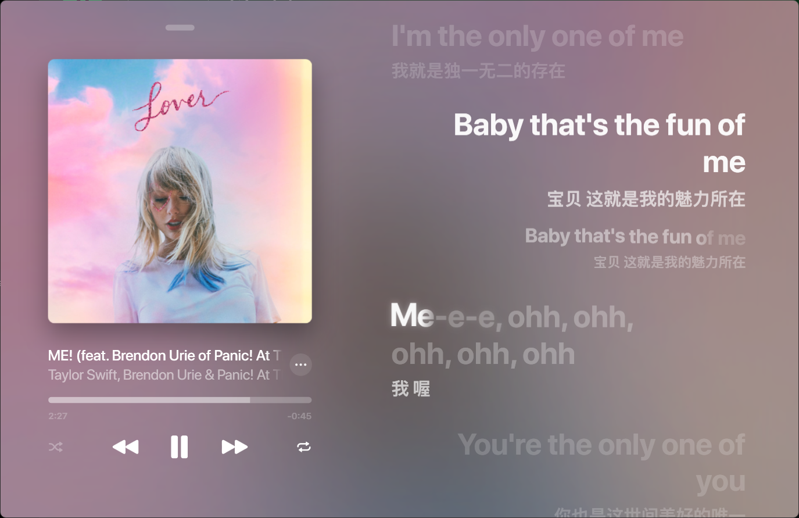
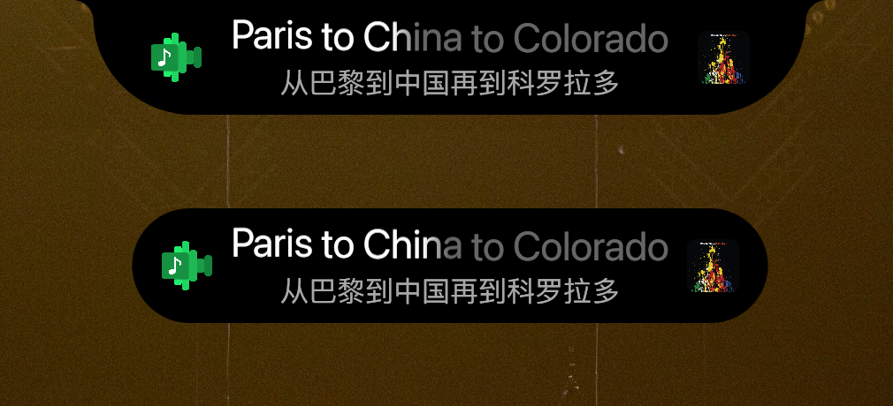
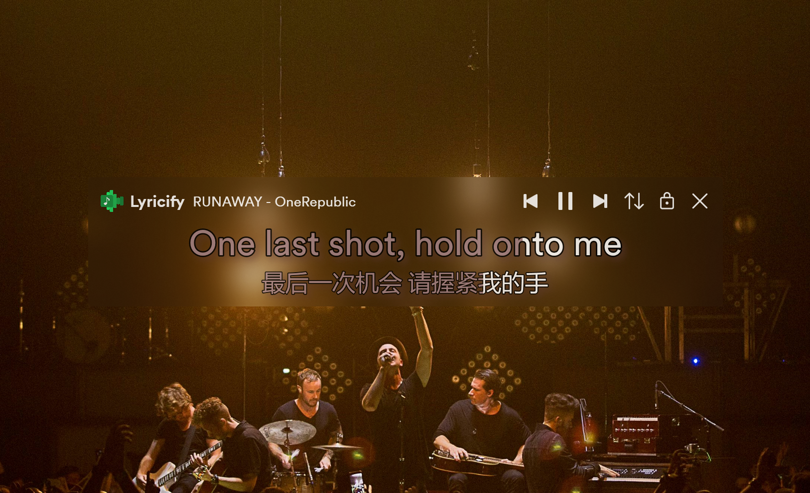
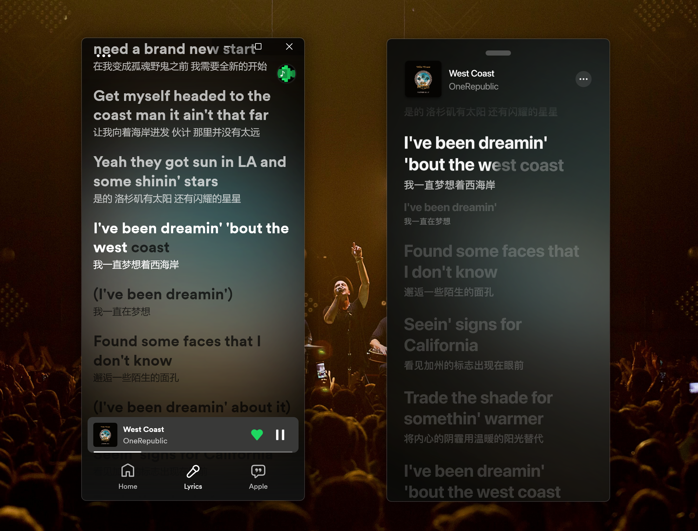
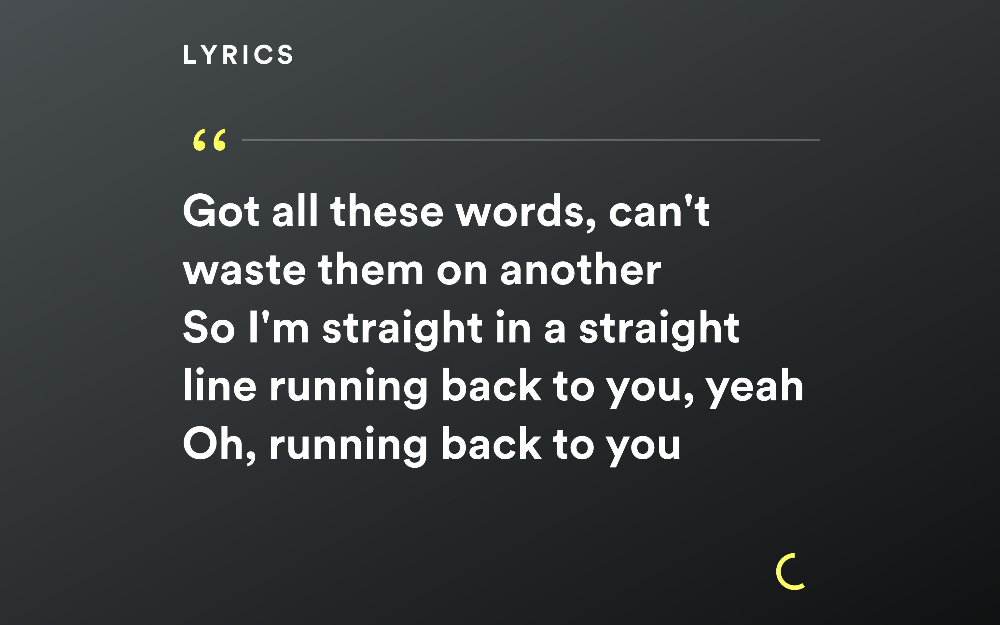
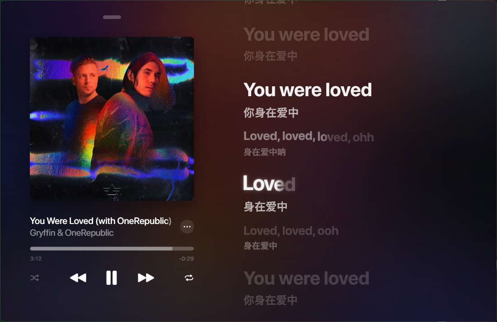

# Lyricify App

**简体中文** · [English](README.EN.md)

| 软件 | 最新版本 | 备注 | 平台 | 使用指南 |
| :-: | :-: | :-: | :-: | :-: |
| [Lyricify 4](#lyricify-4) | [4.3.52-release](https://github.com/WXRIW/Lyricify-App/releases/tag/v4.3.52)  | 适用于 Spotify 用户 | Windows<a href="#ref3">3</a> | [点击查看](https://docs.lyricify.app/lyricify-4/) |
| [Lyricify Fusion](#lyricify-fusion)<a href="#ref1">1</a> (原 Lyricify Lite) | [1.2.5-release](https://github.com/WXRIW/Lyricify-App/releases/tag/lite-v1.2.5)  | 适用于所有接入 SMTC 的应用<a href="#ref2">2</a> | Windows | [点击查看](https://docs.lyricify.app/lyricify-lite/) |
| [Lyricify Mobile](#lyricify-mobile) | [1.5.1-release](https://github.com/WXRIW/Lyricify-App/releases/tag/mobile-v1.5.1) | 适用于 Spotify 用户 | iOS、iPadOS、macOS、Android、Windows | [点击查看](https://docs.lyricify.app/lyricify-mobile/) |
| [Lyricify 3](#lyricify-3) (EOL)<a href="#ref4">4</a> | [3.8.8-release](https://github.com/WXRIW/Lyricify-App/releases/tag/v3.8.8) | 适用于 Spotify、iTunes 等应用<a href="#ref5">5</a>的用户 | Windows<a href="#ref3">3</a> | [点击查看](/docs/Lyricify%203/README.md) |

### 备注
1. Lyricify Lite 将更名为 Lyricify Fusion。由于 Lyricify 4 与 Lyricify Lite 是平行定位，且 Lyricify Lite 众多 Lyricify 4 功能，“Lite”一名容易造成定位误解，因此从 1.3.0 版本起更名为 Lyricify Fusion。
2. Lyricify Fusion 支持所有已接入 SMTC 的应用，如 Spotify、Apple Music、Foobar 2000、HyPlayer、LyricEase、QQ 音乐、网易云音乐 UWP、酷狗音乐、Groove Music 等。
3. Lyricify 4、Lyricify 3 可借助 Wine 实现在 Linux 和 macOS 上运行。Lyricify 4 的实现过程可能比较繁琐，需要耐心尝试。 <strong>对于 Linux 平台：</strong>我们正在尝试让 Lyricify 通过 Wine 在 Linux 平台上运行，并力求简便和稳定。您可以在 <a href="https://github.com/Lyricify/Lyricify-on-Wine">Lyricify on Wine 仓库</a>下载软件包。 <strong>对于 macOS 平台：</strong>在 M 系列芯片的 Mac 上，建议使用 Windows on ARM 虚拟机运行 Lyricify ARM64 版本以获得更好的体验。您也可以使用 Crossover 运行 x64 版本（需要 Windows 7 环境）。
4. Lyricify 3 已进入 EOL 阶段，即生命周期已结束，不会再发布任何新功能、错误修复或软件更新。
5. Lyricify 3 目前支持 Spotify、iTunes、Apple Music、Music Center、QQ 音乐、网易云音乐、YesPlayMusic。建议 Spotify 用户使用 Lyricify 4，不要使用 Lyricify 3。

## 社区

**Telegram 群：**  
https://t.me/lyricify

**Telegram 频道：**  
https://t.me/lyricifyreleases

**QQ 群：**  
[点击加入群聊【Lyricify 用户群 1】](https://jq.qq.com/?_wv=1027&k=hZG8VRV4)（群号：972282479）（已满）  
[点击加入群聊【Lyricify 用户群 2】](https://jq.qq.com/?_wv=1027&k=l0Sy2aGi)（群号：653663090）（已满）  
[点击加入群聊【Lyricify 用户群 3】](https://jq.qq.com/?_wv=1027&k=nUr4jHVU)（群号：515098369）（已满）  
[点击加入群聊【Lyricify 用户群 4】](https://qm.qq.com/q/ejJ0huLLsQ)（群号：630964785）（已满）  
[点击加入群聊【Lyricify 用户群 5】](https://qm.qq.com/q/wGe070e4rS)（群号：561373781）（已满）  
[点击加入群聊【Lyricify 用户群 6】](https://qm.qq.com/q/TEj2v8gvK2)（群号：636998823）（已满）  
[点击加入群聊【Lyricify 用户群 7】](https://qm.qq.com/q/DcxXikjjcA)（群号：748154703）（已满）  
[点击加入群聊【Lyricify 用户群 8】](https://qm.qq.com/q/QfdlJk8keI)（群号：452502909）（已满）  
[点击加入群聊【Lyricify 用户群 9】](https://qm.qq.com/q/yZ6oC6fvAy)（群号：692205529）（已满）  
[点击加入群聊【Lyricify 用户群 10】](https://qm.qq.com/q/F79ZU8ZOJU)（群号：1060101134）  

## Lyricify 开源

Lyricify 的歌词处理相关代码已在 [WXRIW/Lyricify-Lyrics-Helper](https://github.com/WXRIW/Lyricify-Lyrics-Helper) 中以 Apache License 2.0 协议开源。  
Lyricify 的部分动态背景实现也已在 [WXRIW/Lyricify-Backgrounds](https://github.com/WXRIW/Lyricify-Backgrounds) 中以 Apache License 2.0 协议开源。  
欢迎学习、参考和使用 Lyricify 的开源资源，同时请遵守相应的开源协议。也欢迎参与贡献，希望这些项目能为开源社区带来更多价值。

## Lyricify 系列工具

| 软件 | 最新版本 | 备注 | 平台 | 使用指南 |
| :-: | :-: | :-: | :-: | :-: |
| [Lyricify Lyrics Helper](https://github.com/WXRIW/Lyricify-Lyrics-Helper) | [0.2.0-release](https://github.com/WXRIW/Lyricify-Lyrics-Helper/releases/tag/v0.2.0) | Lyricify 歌词处理库 | .NET Standard | [点击查看](https://github.com/WXRIW/Lyricify-Lyrics-Helper/blob/master/README.md) |
| [Lyricify Lines Creator](https://github.com/WXRIW/Lyricify-Lines-Creator) | [0.2.0-beta](https://github.com/WXRIW/Lyricify-Lines-Creator/releases/tag/v0.2.0) | Lyricify Lines 逐行歌词打轴工具 | Windows | [点击查看](https://github.com/WXRIW/Lyricify-Lines-Creator/blob/master/README.md) |

## 未来计划

Lyricify 系列的未来开发计划。

| 软件 | 备注 | 平台 | 预计开发时间 | 当前状态 |
| :-: | :-: | :-: | :-: | :-: |
| Lyricify Mobile Lite | 适用于所有接入 Media Session 的应用 | Android | 2026 年 | 停止开发，相关功能已并入 Lyricify Mobile 1（内测中） |
| Lyricify Mobile 2 | 适用于 Spotify 和 Apple Music 用户 | iOS、iPadOS、macOS | 2026 年 - 2027 年 | 暂缓开发，部分功能已并入 Lyricify Mobile 1（内测中） |
| Lyricify Lyrics Suite | 综合性歌词工具套装 | Windows | 2026 年 - 2028 年 | |

## Lyricify 原创

Lyricify 4 和 Lyricify Fusion 是目前 Lyricify 系列中最具创新的功能结晶，在这里列出部分首创于 Lyricify 的功能。

- 灵动词岛 / Dynamic Lyrics Island *
  - 首创于 2022.09.30
  - 公开于 Lyricify 3.8.1-release
- 妙控条 / Magic Strip *
  - 首创于 2022.10.09
  - 公开于 Lyricify 4.0.0.230121-release
- 歌词界面使用动态专辑封面 / Live Album Cover *
  - 首创于 2022.11.14
  - 公开于 Lyricify 4.0.0.230121-release
- Lyricify Syllable
  - 首创于 2023.03.13
  - 公开于 Lyricify 4.0.8.230315-release
- Lyricify 智能引擎 / Lyricify Intelligent Engine
  - 首创于 2023.04.26
  - 公开于 Lyricify 4.1.0.230503-release

标记 * 的创作采用 [CC BY-SA 4.0 协议](https://creativecommons.org/licenses/by-sa/4.0/) 进行许可。欢迎转载、使用、重新发布，但务必保留创作署名 Lyricify（及作者 WXRIW 或 XY Wang），可用于商业目的；基于创意修改后的作品务必以相同的许可发布。如有任何疑问，请与我联系。

## Lyricify 4

### 不仅有歌词

一款为 [Spotify](https://www.spotify.com) 提供滚动歌词和更多功能的软件。

**需要注意的是：Lyricify 4 仅支持 Spotify！**

点击这里查看 [Lyricify 4 使用指南](https://docs.lyricify.app/lyricify-4/)。

Lyricify 4 是免费软件，仅部分个性化设置为商店版独享。如果你觉得 Lyricify 4 做得不错，可以通过以下渠道支持：

- 在软件的“菜单 - 关于”页面查看打赏方式
- 在 [Microsoft Store](https://apps.microsoft.com/store/detail/9P4WB75RHWCH?launch=true&mode=full) 中购买

如果您在 Microsoft Store 购买过程中遇到困难，可以考虑通过打赏的方式支持 Lyricify。

如果你发现有人在非法销售本软件（只有 Microsoft Store 中的 Lyricify 是官方发布），请联系我们！感谢你的支持！

## Lyricify Fusion

Lyricify Fusion，原名 Lyricify Lite，运行于 Windows 平台，提供灵动词岛、桌面歌词、任务栏歌词、Apple Music 歌词等众多功能，支持所有接入 SMTC 的音乐播放器，包括 HyPlayer、LyricEase、Apple Music、QQ 音乐、网易云音乐 UWP、酷狗音乐、Foobar 2000、Groove Music 等诸多音乐软件。

点击这里查看 [Lyricify Fusion 使用指南](https://docs.lyricify.app/lyricify-lite/)。

## Lyricify Mobile

Lyricify Mobile 是 Lyricify 家族的移动端，目前支持 Android、iOS、iPadOS 和 visionOS 平台，且已发布 Windows 版本。未来版本将提供 macOS 支持。

点击这里查看 [Lyricify Mobile 使用指南](https://docs.lyricify.app/lyricify-mobile/)。

注意，Lyricify Mobile 如果遇到歌词不正确的情况，可以在 Lyricify 4 的歌词管理中进行完善。

## Lyricify 3

一款为 [Spotify](https://www.spotify.com)、[iTunes](https://music.apple.com)、[Apple Music](https://music.apple.com)、[Music Center](https://www.sony.com/electronics/support/articles/MC4PC020001)、[QQ 音乐](https://y.qq.com)、[网易云音乐](https://music.163.com) 和 [YesPlayMusic](https://github.com/qier222/YesPlayMusic) 提供滚动歌词的软件。

点击这里查看 [Lyricify 3 使用指南](/docs/Lyricify%203/README.md)。
