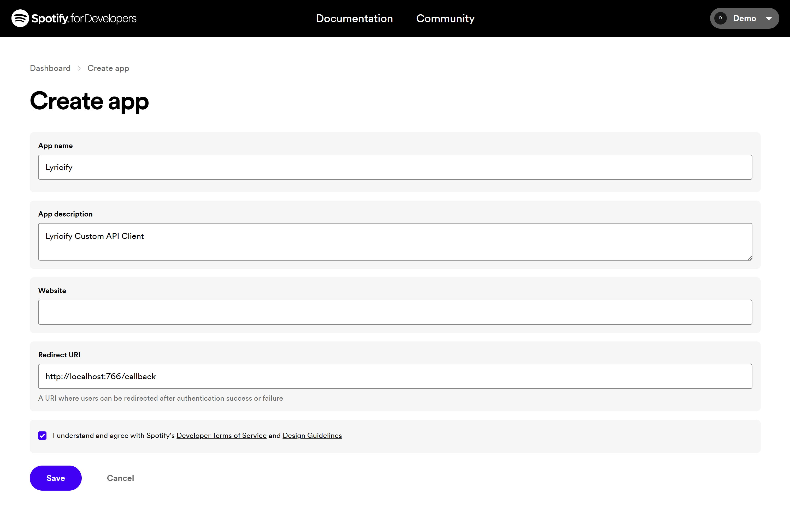
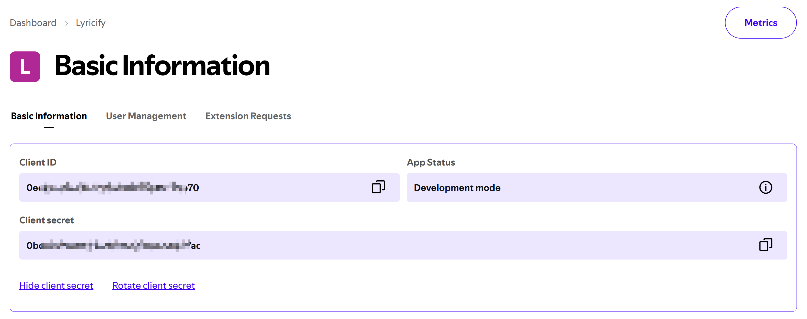
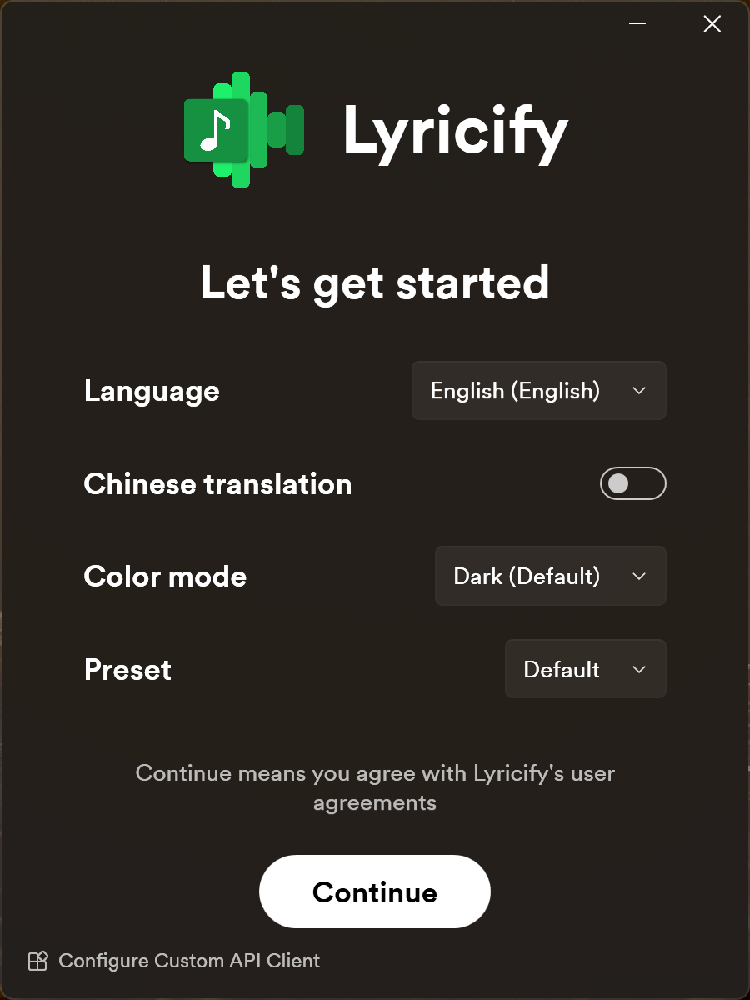

# Custom Spotify API Client Configuration Tutorial
[简体中文](Readme.zh-CN.md)

## Benefits from customising Spotify API Client
Spotify API won't affect you by returning 429 Error anymore.

## Preparations
If you have already completed the preparation steps, you can directly use the previously obtained `Client ID` and `Client Secret` in `Works on Lyricify Mobile` part.
1. Open https://developer.spotify.com/dashboard, if this is your first navigation to this website, you will need to agree with Spotify Developer Terms. Just check `I accept the Spotify Developer Terms of Service` and click `Accept the terms`.

2. Click `Create app` in Dashboard's right top corner.

3. Fill Create app page with these:
   - App name: Lyricify
   - App description: Lyricify Custom API Client
   - Website: (Leave it empty)
   - Redirect URI: http://localhost:766/callback

   Check `I understand and agree with Spotify's Developer Terms of Service and Design Guidelines`；
   Click `Save`.

1. Click `Settings` at the right top corner.
2. Now you can see your Client ID，Click `View client secret` to show the Client secret. `Client ID` and `Client Secret` are needed in future steps.

## Works on Lyricify
1. If you have already logged Spotify in Lyricify, then you will need to log it out first.
2. Click `Configure Custom API Client` in welcome page's left bottom corner.

3. Enter `Client ID` and `Client Secret` you previously obtained.
4. Continue the login, and just enjoy Lyricify.