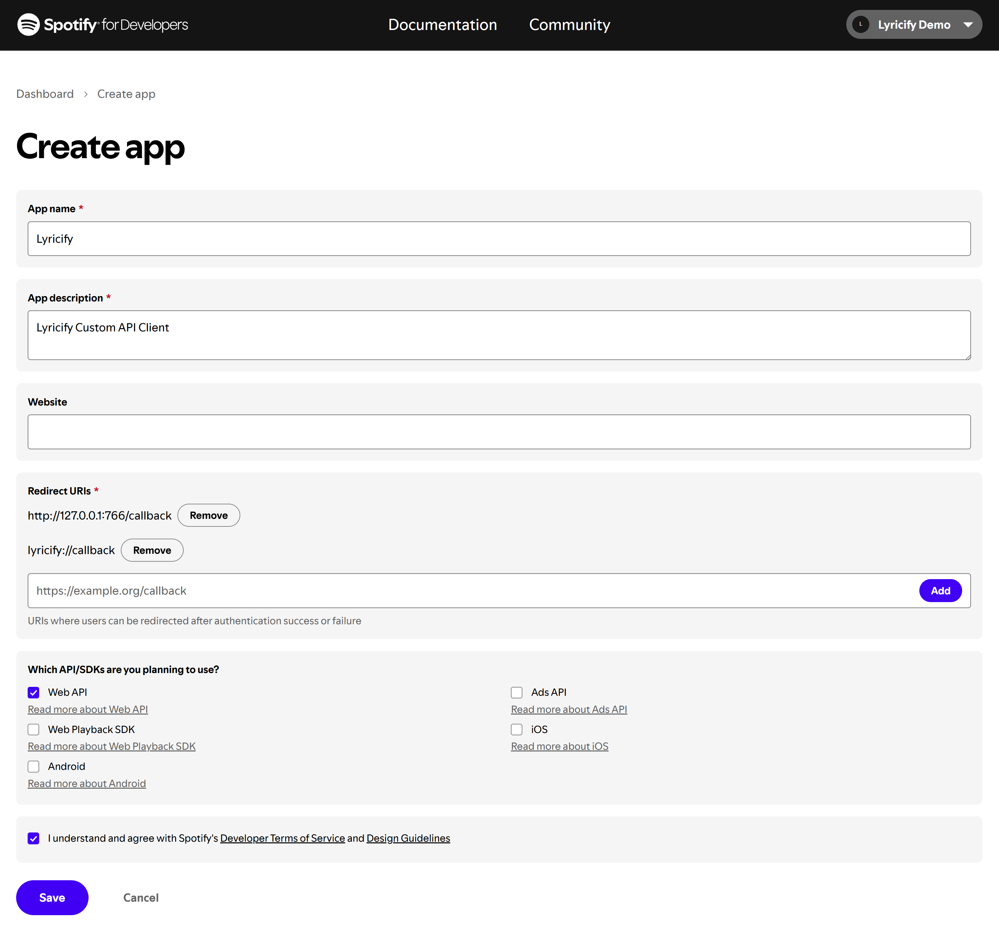

<div align="center">

# 自定义 Spotify API Client 配置教程

</div>

> ⚠️ **注意：**  
> 万恶的 Spotify 近期停用了 Create app 申请通道，可能无法正常创建 app，请等待 Spotify 官方恢复申请。  
> 如有任何问题或反馈可加 [QQ 群](https://qm.qq.com/q/QfdlJk8keI)或 [Telegram 群组](https://t.me/lyricify)。

## 自定义 Spotify API Client 的好处
不再会因 Spotify API 返回 429 错误而影响 Lyricify 使用体验。

## 准备步骤
如果你已经完成过准备步骤，则可以直接使用之前获得的 `Client ID` 和 `Client Secret`，在 `Lyricify 上的工作` 中使用。
1. 在浏览器中登录 Spotify (https://www.spotify.com) ，如果你已登录，可进入步骤 2。
2. 打开 https://developer.spotify.com/dashboard ，如果你是第一次打开这个网址，则需要先同意 Spotify Developer Terms。勾选下方的 `I accept the Spotify Developer Terms of Service`，再点击 `Accept the terms` 即可。

3. 点击 Dashboard 页面右上方的 `Create app`。  
   如果提示 `You need to verify your email address before you can create an app.`，则需要你先验证你的邮箱。

4. 在 Create app 页面中填写以下信息：
   - App name: Lyricify
   - App description: Lyricify Custom API Client
   - Website: （空着不写）
   - Redirect URI: （填写以下两条，每条填写完成后点击 `Add` 按钮）
     - http://127.0.0.1:766/callback
     - lyricify://callback
5. 勾选 `Which API/SDKs are you planning to use?` 部分中的 `Web API`；  
   勾选 `I understand and agree with Spotify's Developer Terms of Service and Design Guidelines`；  
   点击 `Save` 按钮。  

6. 这时你就能看到 Client ID，点击 `View client secret`，即可显示 Client secret。在后续步骤中将需要用到 `Client ID` 和 `Client Secret`。


## Lyricify 上的工作
1. 如果你已经在 Lyricify 中登录了 Spotify，则需要先在 Lyricify 中退出登录。
2. 点击欢迎界面左下角的 `配置自定义 API Client`。  

3. 在弹出的窗口中输入准备步骤中获取到的 `Client ID` 和 `Client Secret`，点击确定即可。
4. 继续完成登录，享受你的 Lyricify 之旅吧。

# 常见问题

## 授权时提示 INVALID_CLIENT: Invalid redirect URI
请检查 `Redirect URI` 是否填写错误，确保其值包含 `http://127.0.0.1:766/callback`，而不是 `https://127.0.0.1:766/callback`。

### 特别注意
如果你**在 2025 年 4 月 9 日前**创建并配置过自定义 API Client，请务必前往 Spotify Developer Dashboard 更新设置。由于 Spotify 调整了对重定向 URI 的要求，**原本使用 `localhost` 的 URI 已不再被接受**，你需要将原先的：

```
http://localhost:766/callback
```

替换为：

```
http://127.0.0.1:766/callback
```

请进入对应应用的设置页面，并在 `Redirect URI` 中添加 `http://127.0.0.1:766/callback`。完成后即可正常使用自定义 API Client 进行授权。  

> ⚠️ 注意：`127.0.0.1` 是 `localhost` 的等效 IP 地址，在当前 Spotify 的校验机制中被视为有效地址，而 `localhost` 会被拒绝。