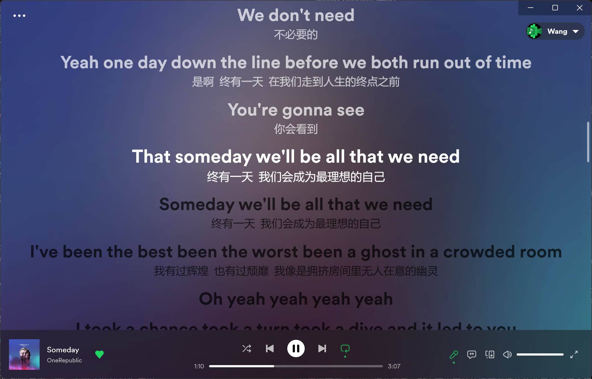
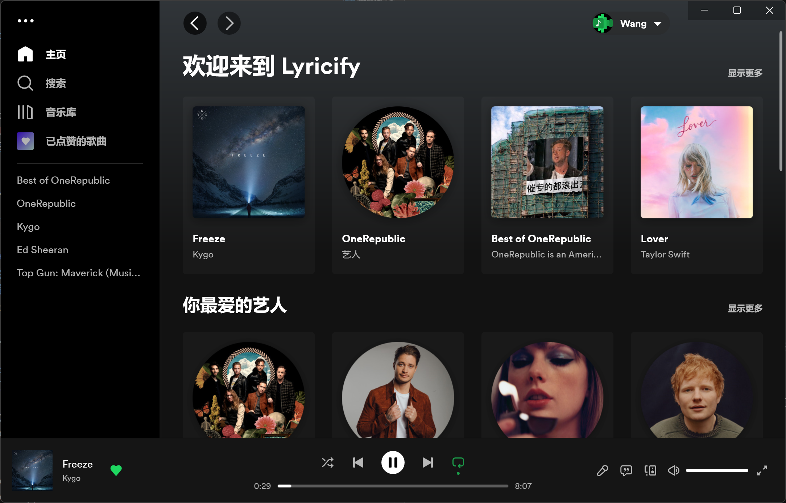

<div align="center">

# Lyricify 4 使用指南

</div>

## 快速导航 & 常见问题
如果您是 Lyricify 4 的新用户，建议您完整阅读本指南！阅读后，您将掌握更多 Lyricify 4 使用技巧，并节约大量时间。  
如果您是 Lyricify 4 的老用户，遇到了一些问题，则可以在下方查找是否有您想知道的问题。  

### 功能
- [Spotify Premium 在 Lyricify 中的独占功能](#spotify-premium-%E7%8B%AC%E5%8D%A0%E5%8A%9F%E8%83%BD)
- [歌词导入](#%E6%AD%8C%E8%AF%8D%E6%A0%87%E8%AE%B0%E5%8F%8A%E5%AF%BC%E5%85%A5)
- [歌词管理及高级操作](#%E6%9B%B2%E7%9B%AE%E7%AE%A1%E7%90%86)
- [全局快捷键](#%E5%85%A8%E5%B1%80%E5%BF%AB%E6%8D%B7%E9%94%AE)
- [曲库可用性查询](#%E5%8F%AF%E7%94%A8%E6%80%A7%E6%9F%A5%E8%AF%A2)
- [开机自启动](#%E5%BC%80%E6%9C%BA%E8%87%AA%E5%90%AF%E5%8A%A8)
- [自定义配置](#%E8%87%AA%E5%AE%9A%E4%B9%89%E9%85%8D%E7%BD%AE)

### 常见问题
- [启动时提示错误](#%E5%90%AF%E5%8A%A8-lyricify-%E6%97%B6%E6%8F%90%E7%A4%BA%E9%94%99%E8%AF%AF)
- [切歌后反应迟钝](#%E5%88%87%E6%AD%8C%E5%90%8E%E5%8F%8D%E5%BA%94%E8%BF%9F%E9%92%9D)
- [过多请求 429 错误](#%E6%80%BB%E6%98%AF%E6%8F%90%E7%A4%BA%E5%87%BA%E7%8E%B0-429-%E9%94%99%E8%AF%AF)
- [Apple Music 歌词界面卡顿](#apple-music-%E6%AD%8C%E8%AF%8D%E7%95%8C%E9%9D%A2%E5%8D%A1%E9%A1%BF%E9%97%AE%E9%A2%98)
- [专辑图片不显示](#%E6%97%A0%E6%B3%95%E5%8A%A0%E8%BD%BD%E4%B8%93%E8%BE%91%E5%9B%BE%E7%89%87)
- [Lyricify 不显示歌词](#lyricify-%E6%97%A0%E6%B3%95%E8%8E%B7%E5%8F%96%E5%BD%93%E5%89%8D%E6%92%AD%E6%94%BE%E4%BF%A1%E6%81%AF)
- [无法导入歌词](#%E6%97%A0%E6%B3%95%E5%9C%A8-%E6%9B%B2%E7%9B%AE%E7%AE%A1%E7%90%86-%E4%B8%AD%E4%B8%8A%E4%BC%A0%E6%AD%8C%E8%AF%8D)
- [其它常见问题](#%E5%B8%B8%E8%A7%81%E9%97%AE%E9%A2%98-1)

**注意：** 如需反馈或提问，对于 Lyricify 功能，请使用[官方认定的正确的名称](#lyricify-%E5%90%8D%E8%AF%8D)来描述。  

Lyricify 4 是免费软件，如果你觉得 Lyricify 4 做的不错，则可以通过以下渠道支持：
- 在软件中，菜单-关于页里有打赏方式
- 在 [Microsoft Store](https://apps.microsoft.com/store/detail/9P4WB75RHWCH?launch=true&mode=full) 中购买

如果你发现有人在非法销售本软件 (只有 Microsoft Store 中的 Lyricify 是官方发布)，请联系我们！感谢你的支持！  

# Lyricify 4 基础

## 运行 Lyricify 4
如果您想使用 Lyricify 4，请确保您的系统中安装了 `.NET Desktop Runtime 6.0`，如果启动时提示您的未安装，则需要您在这里下载安装：  
点击下载 .NET Desktop Runtime 6.0.16 [x86](https://dotnet.microsoft.com/zh-cn/download/dotnet/thank-you/runtime-desktop-6.0.16-windows-x86-installer) [x64](https://dotnet.microsoft.com/zh-cn/download/dotnet/thank-you/runtime-desktop-6.0.16-windows-x64-installer) [Arm64](https://dotnet.microsoft.com/zh-cn/download/dotnet/thank-you/runtime-desktop-6.0.16-windows-arm64-installer)   
[点击转到 .NET 6.0 官方下载地址](https://dotnet.microsoft.com/zh-cn/download/dotnet/6.0)

## 初次使用 Lyricify 4 应了解
进入主界面的时候，如果当前没有正在播放的歌曲，请不要尝试点击播放按钮，因为这是没有作用的！！！Lyricify 是歌词软件，不是播放器，不在 Spotify 播放音乐怎么会显示歌词呢？  

### Spotify Premium 独占功能
1. Lyricify 智能引擎
2. 任意点歌（点击播放按钮，或双击歌单、专辑中的歌曲）
3. 控制播放（调整进度、播放、暂停、上一曲、下一曲、循环、随机）（免费账户在 Media Session 连接正常的情况下也可以控制播放）
4. 控制音量
5. 添加到播放列表
6. 内嵌播放必须有 Spotify Premium 订阅

## 欢迎窗口

### 基本设置
首次打开 Lyricify 4 时，会出现一些基础设置。
- **语言：** Lyricify 显示语言及 Spotify 内容语言。与 Spotify 的设置保持一致时可以获得最佳 Media Session 体验。如果您听华语偏多，建议将显示语言设置为中文，这样可以提高歌词自动搜索的准确度
- **中文翻译：** 是否在歌词有中文翻译时显示
- **颜色模式：** `深色主题` 或 `浅色主题`，在 `Lyricify 4 进阶` 中将介绍如何自行制作自定义配色主题配置
- **预设配置：** 一般情况下设置为默认即可，如果您的设备性能较差，可以设置为 `更好的性能`，如果您的设备性能很棒，则可以尝试设置为 `更好的质量`
  - *默认：* 推荐的设置
  - *更好的性能：* 关闭部分功能和特效，以保证流畅的歌词体验
  - *更好的质量：* 开启所有特效，这可能会导致在部分设备上歌词滚动时卡顿，尤其是 `Apple Music 歌词` 界面

完成上述设置后点击继续即可。

### 登录到 Spotify
Lyricify 4 仅支持 Spotify，所以您必须完成 Spotify 授权才可以正常使用 Lyricify 4。  
此步骤将自动在您的网页浏览器中打开 Spotify 授权网页，您需要做的是在该网页中完成 Spotify 的授权。完成授权后，网页会出现如下提示：
```
成功！
Spotify 授权成功。您现在可以关闭这个标签页并回到 Lyricify。
```
此时，回到 Lyricify 的欢迎界面，应该出现 `成功连接 Spotify` 的提示。如果出现 `Spotify 授权完成，请再等待几秒`，则说明 Spotify 授权已经完成，正在进行 Lyricify 服务器注册，等待几秒即可。  
最后，点击 `继续` 按钮即可开启全新 Lyricify 体验。

## Lyricify 4 主界面
如果您正在任何登录了该 Spotify 账号的设备上播放音乐，不出意外的话该曲目的歌词会显示在 Lyricify 的 `歌词` 界面。  
  
如果您没有在 Spotify 播放音乐，则会出现 `Lyricify 主页`。如果您正在 `歌词` 界面，也可以通过右下方控制区域的第一个麦克风图标来隐藏 `歌词` 界面，隐藏后将显示 `Lyricify 主页`。  
  
如果您没有正在播放的音乐，并且当前无在线的 Spotify 设备，那么点击下方的播放按钮或 `Lyricify 主页` 中的播放按钮是不会有效果的。如果您想脱离 Spotify 直接使用 Lyricify 来播放音乐，则需要配置 Lyricify 内置播放，此功能将在 `Lyricify 4 进阶` 中详细介绍。

### 按键及功能
下面是 `Lyricify 4 主界面` 中的按键及功能介绍。
- **主菜单：** 点击窗口左上角的 `···` 按钮即可打开 Lyricify 主菜单，主菜单中包含了 Lyricify 的各类功能入口和基础设置。
- **导航栏：** 左侧的导航栏提供了一些快捷方式。
  - *主页：* Lyricify 主页
  - *搜索：* Lyricify 搜索页，其中包含了 `Spotify 搜索`、`歌词搜索（暂不可用）` 和 `可用性检查`，具体介绍见后文
  - *音乐库：* Spotify 音乐库，内容与 Spotify 音乐库基本一致
  - *已点赞的歌曲：* Spotify 音乐库中的歌曲，与 Spotify 保持一致
  - *快捷访问：* 您可以在这里固定一些快捷访问项目，目前支持 `歌单`、`专辑` 和 `艺人`，您可以通过右击 `歌单` 等，点击 `固定到快捷访问` 来固定该项目。
- **用户组件：** 右上角的用户组件，包含了关于当前登录用户的信息，以及 `设置` 和 `关于` 的入口，`登出` 也需要在这里操作，如果开启了 `Media Session 增强` 功能，这里会显示 Media Session 的连接状态
- **歌曲信息区：** 左下角的歌曲信息区
  - *专辑图片：* 点击可以打开 `歌曲信息`，`音频特性` 也包含在 `歌曲信息` 中
  - *歌名：* 点击或右击歌名可显示菜单，该菜单中包含部分跳转， `曲目管理` 可以在此菜单中打开
  - *艺人：* 点击艺人即可跳转至该艺人主页
- **播放控制区：** 下方中间区域。注意：Lyricify 的控制功能需要 Spotify Premium 订阅。但在 Media Session 启用后，则可以控制 Spotify Free 账户的播放（必须是本设备上的客户端）
- **功能控制区：** 右下方的按钮区域
  - *歌词：* 麦克风按钮，点击即可打开或关闭 `歌词` 界面
  - *Apple Music 歌词：* 第二个按钮，点击即可进入 `Apple Music 歌词` 界面
  - *Spotify Connect：* 第三个按钮，点击即可管理 Spotify Connect，与 Spotify 客户端的操作类似
  - *音量控制：* 控制音量。注意：该功能需要 Spotify Premium 订阅
  - *全屏：* 点击即可进入 `Lyricify 全屏` 界面，右击可进入 `移动端 UI 全屏` 界面

### 竖屏样式
当您将窗口缩小为竖屏模式时，Lyricify 会自动调整为 `竖屏样式`，类似于 `Spotify 移动端样式`。

## 歌词操作
与 Lyricify 前三个大版本中类似，Lyricify 4 也有 `歌词标记` 功能，并在提供了更加强大的歌词管理器 `曲目管理`。

### 歌词来源
Lyricify 4 允许用户自行选择首选自动搜索词源。Lyricify 4 目前支持的自动搜索词源有：`QQ 音乐`、`网易云音乐`。  
需要注意的是，Lyricify 4 的部分特性和功能仅支持 `QQ 音乐` 歌词。例如：
- *卡拉 OK 样式：* `QQ 音乐` 歌词可以提供“真”卡拉 OK，而其他来源的歌词只能提供“假”卡拉 OK。在 `Apple Music 歌词` 界面中，仅 `QQ 音乐` 歌词支持卡拉 OK 样式
- *精确的时间轴：* 绝大部分 `QQ 音乐` 歌词可以提供更加精确的时间轴信息，从而提供更好的体验，尤其是在 `Apple Music 歌词` 界面中

此外，部分 `网易云音乐` 歌词不符合 LRC 文件的格式规范，所以在反序列化时会出错，导致歌词无法正常显示。`QQ 音乐` 歌词不规范的情况相对较少。
#### Lyricify 4 获取歌词的过程（进阶）
  1. 请求 Lyricify 4 的服务器，获取曲目的歌词信息。如果 Lyricify 4 的服务器上没有该曲目的歌词，则会进行步骤 2
  2. ~~请求 Lyricify 3 的服务器，获取曲目的歌词信息。如果 Lyricify 3 的服务器上没有该曲目的歌词，则会进行步骤 3~~ (4.0.9 及之后的版本移除了 Lyricify 3 歌词服务器支持)
  3. 自动搜索歌词，如果用户首选词源没有找到歌词，则会从备选词源获取
  4. 特殊情况：如果步骤 1 或步骤 2 中获得的歌词的来源并不是用户的首选来源，Lyricify 仍然会使用此歌词。如果需要想使用首选来源的歌词，请打开 `曲目管理` 搜索标记。在 Lyricify 歌词库中有歌词时，会直接使用，不会使用其他来源。

### 歌词标记及导入
Lyricify 4 提供 `歌词标记` 功能，您可以把自动搜索的正确歌词在服务器上标记为正确，这样做有许多好处。
- **提高歌词获取效率：** 标记后 Lyricify 将直接从 Lyricify 服务器获取歌词，而不需要再进行自动搜索的过程，自动搜索耗时约 `0.5-2s`，并且能减轻 QQ 音乐和网易云音乐服务器的负担
- **确保歌词的正确性：** 自动搜索的结果并非一直不变的，随着时间的推移，该结果可能会发生变化，甚至出现词不对曲的错误
- **保持歌词的可用性：** 部分歌曲在下架后无法被搜索到，也就无法获取歌词。标记歌词后，歌词将被上传至服务器，上传至服务器的歌词将一直可用

如果自动搜索的歌词是正确的，则可以通过以下方式快速标记：
1. 滑动到 `歌词` 界面的最下方，会显示当前歌词的来源。
2. 点击来源，在打开的菜单中点击 `标记为正确歌词` 即可完成标记。
3. 您也可以直接使用 `Shift + Alt + Q` 来快速标记。（注意：这不是全局快捷键，仅焦点在 Lyricify 主窗口时可使用）

如果自动搜索的歌词不正确，或者没有搜索到歌词，则可以手动导入：
1. 点击 `歌词` 界面中的 `手动导入 (打开曲目管理)` 按钮，进入 `曲目管理`。您还可以通过点击左下角歌名，在打开的菜单中点击 `打开曲目管理`。如果您正在 `Apple Music 歌词` 界面，则可以通过点击 `···` 圆形按钮，再点击 `打开曲目管理`。
2. 自行在 `QQ 音乐` (推荐) 或 `网易云音乐` 中找到正确的歌曲，并获取 `分享链接` 或 `Id` 或 `Mid (QQ 音乐)`。
3. 点击对应来源的 `导入` 按钮，输入上面信息。
4. 点击确定后，会显示导入的歌词信息（如果有翻译，则并不会显示翻译内容），如果歌词信息正确，请点击 `在主窗口中应用` 按钮，这时，歌词会被加载至 Lyricify 4，您需要检查歌词内容是否正常，时间轴是否正确等等。
5. 当所有信息均正确时，点击 `保存 (上传) ` 按钮，即可将您导入的正确歌词信息上传至服务器。
6. 注意：如果您打开 `曲目管理` 后发现，已经存在歌词信息（错误的），这时您仍然可以通过上述步骤覆盖已有的歌词信息。
7. 您也可以尝试先点击 `搜索` 按钮，如果点击后按钮变红，则说明没有找到歌词，如果按钮变绿，则说明找到了歌词，如果这个歌词是正确的 (`在主窗口中应用` 后检查是否正确)，您可以点击 `保存 (上传)` 按钮即可将自动搜索到的正确歌词上传 Lyricify 4 的服务器。
**在不能确保歌词是正确的情况下，请不要点击 `保存 (上传)` 按钮！**

如果该曲目在 QQ 音乐和网易云音乐均无歌词，则可以手动上传：  
具体步骤详见 [进阶教程](#Lyricify-%E6%AD%8C%E8%AF%8D%E5%BA%93)。

如果该曲目是纯音乐，则可以将其标记为纯音乐：
1. 同 `手动导入` 的步骤 1。
2. 将 `纯音乐` 复选框选为 `是`。
3. 点击 `保存 (上传) ` 按钮。

### 全局快捷键
Lyricify 4 支持全局快捷键，且支持自定义。  
您可以在 `Lyricify 主菜单` `高级` `热键管理器` 中自定义快捷键。  

| 功能 | 默认快捷键 | 默认开启 |
| :-: | :-: | :-: |
| 桌面歌词 | Alt + Shift + W | 是 |
| 灵动词岛 | Alt + Shift + D | 是 |
| 重置窗口 | Ctrl + Shift + R | 是 |
| 播放 / 暂停 | 无 | 否 |
| 上一首 | 无 | 否 |
| 下一首 | 无 | 否 |

#### 设置快捷键的方法
1. 点击右侧的快捷键文本框。
2. 按下你想设置的快捷键。
3. 如果您想为其他功能设置快捷键，请回到 `步骤 1` 继续操作；如果您已经完成所有快捷键的设置，则可以点击 `应用` 按钮。
   应用后，如果一切正常，窗口将自动关闭，不会弹出其它消息框；如果遇到问题，则会弹出提示消息框。

如果您想禁用某个快捷键，您可以按 `BackSpace` 键以删除这个快捷键。最后点击 `应用` 按钮完成设置。

## 设置

### 字体
Lyricify 4 有着强大的自定义字体功能，您可以为 `歌词` 界面、`Lyricify 全屏` 界面、`桌面歌词` 设置自定义字体。
如果您想要自定义字体，则可以通过以下步骤实现：
1. 设置中找到对应界面的 `字体家族` 设置，点击 `自定义` 按钮。
2. 这时会打开 `字体选择工具` 窗口，左侧为已安装字体列表，右侧为自定义字体列表。
3. 在左侧找到你想设置的字体，选中后点击 `添加到列表` 或直接双击该字体，即可添加至右侧自定义字体列表。
4. 点击确定即可保存。在保存之前，您可以在 `预览` 文本框中测试自定义字体效果。
5. 如果您想为中西文设置不同字体，可以自行了解 `字体回退机制`，Lyricify 4 自带的 `字体选择工具` 支持 `字体回退 (Font Fallback)`。

**如果您想使用某字体的加粗版本，您可以这样设置：**  
1. 首先在 `字体选择工具` 中设置好字体（步骤在上方）。
2. 点击设置页最下方 `设置文件` 的 `打开` 按钮。
3. 在打开的文件中找到对应的字体配置。
   - 主歌词: `window_main` `font_family`
   - 桌面歌词: `desktop_lyrics` `font_family`
   - Lyricify 全屏: `lyricify_fullscreen` `font_family`
4. 修改字体名，在字体名后加上 ` Bold`，如 `Microsoft YaHei` 修改后为 `Microsoft YaHei Bold`。

**注意：**  
1. 并非所有字体都支持这种修改为加粗版本的方式。
2. 如果有不理解的地方，您可以自行搜索和学习 `Json 文件` 的相关知识。

# Lyricify 4 进阶

## 曲目管理
这里是 `歌词标记及导入` 部分的补充说明。  
### 在哪里可以打开 曲目管理
- 主界面左下角，点击或右击歌名，或右击专辑图片，点击菜单中的 `打开曲目管理`。
- 主界面歌词最下方 `歌词提供者`，点击或右击，点击菜单中的 `管理本曲目`。
- Apple Music 歌词中，点击 `···` 点击菜单中的 `打开曲目管理`。

### 时间轴
如果已有歌词时间轴有偏差，您可以通过修改歌词的 `Offset` 值来调整。具体方法如下：
1. 手动输入新的 `Offset` 值（整数），单位是毫秒。
2. 点击 `在主窗口中应用`，之后观察时间轴是否正确。建议修改 `Offset` 时退出 `Apple Music 歌词` 界面，这样加载速度更快。
3. 建议通过点击歌词（主窗口中）来检查时间轴是否正确。
4. 注意：不要在没有 `Media Session 连接` 的情况下调整 `Offset！`

### 对唱视图
曲目管理中可以设置歌词的对唱视图信息。  
**技巧：** 双击 `对唱视图` 标题即可清除对唱信息。  
  
**对唱视图标准：**
- 对于华语“男女合”类型的歌曲，如果女声部分大于男生部分，则将女声设置在左侧，男声设置在右侧，合唱设置在左侧。
  其他情况男声在左，女声在右，合唱在左。
- 对于其他语言中有两位歌手演唱的歌曲，一般遵循首句靠左的规则；若唱首句的歌手在后面的歌词中出现的次数远少于另一位歌手，则可以首句靠右，主要部分靠左。合唱部分一律靠左。
- 对于有大于等于三位歌手演唱的歌曲，推荐以下处理方法：
  - 全部靠左
  - 轮流左右，遇到合唱也更换左右
  - 三人的特殊情况可以参考[这首歌](https://open.spotify.com/track/4vUmTMuQqjdnvlZmAH61Qk)

### Lyricify 歌词库
如果 QQ 音乐、网易云音乐均无歌词，则可以手动导入歌词到 Lyricify 歌词库。
1. 注意：如果 QQ 音乐或网易云音乐有正确歌词，请不要手动上传其他来源歌词 (含 Spotify 歌词、酷狗歌词、自制歌词等)！若违反，你的账户有几率会被限制。
2. 滚动到最下方，找到 `Lyricify 歌词库`，点击 `导入 & 编辑` 按钮。
3. 如果 Spotify 里有这首歌的歌词，则可以点击 `导入 Spotify 歌词` 按钮来导入。
4. 如果 Spotify 里没有这首歌的歌词，而 酷狗音乐 中有这首歌的歌词，则可以通过点击 `导入酷狗歌词` 按钮，自动搜索并获取酷狗音乐歌词。
5. 如果没有获取到歌词，则需要在打开的窗口中粘贴歌词（请粘贴含时间轴的歌词文件！目前支持 LRC、QRC、Lyricify Syllable 和 Apple Syllable）
6. 关闭窗口，在保存提示对话框中点击 `是`。
7. 若想上传翻译，则可以再次点击 `导入 & 编辑` 按钮，点击弹出窗口右上角的 `添加翻译` 按钮，之后手动添加翻译。
8. 点击 `曲目管理` 右下角的 `保存 (上传)`。

**注意：**
1. 步骤 5 中的歌词制作可参考 [Lyricify 4 歌词指南及标准](https://github.com/WXRIW/Lyricify-App/blob/main/docs/Lyricify%204/Lyrics.md)。  
2. 中文歌词必须使用简体中文！若上传繁体中文歌词，你的账户将有几率会被限制。  
3. 上文中的“QQ 音乐、网易云音乐均无歌词”指：QQ 音乐和网易云音乐上均没有对应曲目或对应曲目无歌词。通过 Lyricify 上的搜索按钮没有搜到对应歌词不代表真的没有，需要手动去 QQ 音乐和网易云音乐的 App 内查找，确保没有对应歌词后才可认为“均无歌词”。  
4. QQ 音乐、网易云音乐有歌词但均无翻译不算作“均无歌词”，这种情况下上传歌词和翻译到 Lyricify 歌词库仍算作违规。您可以到网易云音乐提交翻译，等待过审后 Lyricify 会自动拉取翻译。

## 可用性查询
在 Lyricify 4 中，您可以很方便的检查专辑、歌单、已点赞的歌曲在不同地区的可用性。  
可用性查询在 `主界面左侧导航栏` `搜索` `可用性` 里。  

### 专辑
将专辑的分享链接或 Spotify URI 粘贴在文本框中，Lyricify 将自动开始检查这张专辑的可用性，还会检查该专辑其他版本的可用性。
如果您粘贴的是歌曲链接，则会自动检查这首歌所在专辑的可用性。  

### 歌单
将歌单的分享链接或 Spotify URI 粘贴在文本框中，Lyricify 将自动开始检查这个歌单的可用性。  
您可以在右上角选择查询其它市场中此歌单的可用性。  

### 已点赞的歌曲
在文本框中输入 `Liked Songs`、`已点赞的歌曲`、`已按贊的歌曲` 或 `spotify:user:{你的账号 ID}:collection`，即可开始检查。

## 自定义配置
### 自定义配色主题配置
Lyricify 支持用户自行设计配色方案，设计好的配色方案也可以很方便的共享给其他用户。  
默认配色主题文件可以在这里找到：[深色配色](../../resources/theme/DarkTheme.xaml)；[浅色配色](../../resources/theme/LightTheme.xaml)  

以上配色均包含详细的注释，您在修改后可以将配色主题文件加载到 Lyricify 中查看效果。  

### 国际化 (将 Lyricify 翻译为其他语言)
Lyricify 十分欢迎热心的您将其翻译为更多语言，为 Lyricify 提供国际化支持。  
Lyricify 国际化的贡献者将在 `Lyricify 关于` 页列出。  
[这里有 Lyricify 的各语言原文文件](/i18n/Lyricify%204/)

### 加载自定义配置文件
1. 打开 `菜单` `高级` `自定义配置管理器`。
2. 点击打开窗口左下角的 `添加配置` 按钮。
3. 找到您需要加载的自定义配置文件 (*.xaml)，选中后点击打开。
4. 这时，此配置文件将被加载到 Lyricify 中。

### 自定义配置文件信息
您可以在自定义配置文件头部附上相关信息，请务必使用下列标准格式，这样可以确保被 Lyricify 4 自定义配置管理器正确识别。
```
<!-- Name: 在这里输入自定义配置的名称 -->
<!-- Description: 在这里描述这个自定义配置的相关信息，你也可以在这里加上作者信息和联系方式。 -->
```

## 本地文件
如果您想在 Lyricify 中显示 Spotify 播放的本地歌曲的图片，则需要在这里手动添加图片。
### 使用方法
1. 打开 Lyricify，然后打开 Spotify，播放本地歌曲。当 Lyricify 中显示了该本地歌曲后，说明这首歌已经录入，可以在 `Lyricify 本地文件管理器` 中关联图片。
您可以把您想要关联图片的歌曲一次性加载完（只要 Lyricify 中显示了该歌曲就说明已经完成了录入），然后再一起关联。
2. 打开 `Lyricify 主菜单`，打开 `高级` `本地文件管理器`。
3. 在这里会显示所有已经录入的所有曲目信息。
4. 点击 `专辑` 或 `曲目` 中的项目即可为其添加图片信息。
   为 `专辑` 添加图片后，所有该专辑下的曲目均会使用这张图片。  
   而为 `曲目` 添加图片后，仅对该曲目有效。如果某曲目在 `曲目` 和 `专辑` 下均设有图片，则 Lyricify 会使用 `曲目` 下设置的图片作为显示图片。
注：如果在 `本地文件管理器` 中没有找到某首歌，可能是因为这首歌的歌名、专辑名、歌手名太长了，可以通过手动修改本地文件信息来解决。

## 使用 Lyricify 内置播放
Lyricify 4 支持内置播放，但是并不建议使用。这只是一个测试功能！  
**Lyricify 4 在使用 Spotify 客户端 (并有 Media Session 可用连接) 时效果最佳。**  
该功能基于 Spotify 网页版，并且需要 Spotify Premium 订阅。首次使用前需要进行如下配置：
1. 打开 `Lyricify 主菜单`，打开 `高级` `登录到 Spotify 网页版`。
2. 如果在弹出的窗口中提示登录 Spotify，则需要先完成 Spotify 账号的登录。如果没有显示任何内容，请检查您的系统是否安装了 `Microsoft Edge WebView2 Runtime`。
3. 完成登录后会打开 Spotify 网页版，如果 Spotify 网页版显示正常，也可以正常播放歌曲，则表明 Lyricify 4 的内置播放已经配置完成。
4. 重新打开 Lyricify，直接点击首页中你想播放的内容的播放按钮，等待片刻（3-5s），再次点击播放按钮，即可开始播放。

该功能存在许多问题，如果不能正常播放，那就算了吧~~

## 备份与自动化中心
该功能仍在开发阶段。

## 设置文件
手动修改设置文件。Lyricify 4 的设置文件路径为 `%AppData%/Lyricify/Lyricify for Spotify/settings.json`。  
您也可以在 `设置` 页面最下方找到 `设置文件` 的 `打开` 按钮。  
在完成编辑后，您可以点击 `加载` 按钮，立即将设置加载至 Lyricify。  
[这里有 Lyricify 4 设置文件各个项目的详细介绍](settings.json)  

## 开机自启动
1. 在 `Windows 资源管理器` 的地址栏中输入 `%AppData%\Microsoft\Windows\Start Menu\Programs\Startup`，按 `Enter` 键。
2. 将 Lyricify 快捷方式复制到此文件夹中即可。

## Apple Music 歌词流畅度优化
Apple Music 歌词界面 CJK (中日韩) 歌词流畅度较低，这是微软的锅。  
*本优化对于灵动词岛的卡顿问题也有作用。*  
在这里，Lyricify 提供了优化方案。  
**注意：** Lyricify 4.0.9 或更高版本中会自动执行本优化，无需用户手动执行。(微软商店版本因权限和重定向问题，无法实现自动安装，需手动优化)  
**方法：**  
1. 下载 [PingFang SC for Lyricify.7z](https://github.com/WXRIW/Lyricify-App/raw/main/resources/font/PingFang%20SC%20for%20Lyricify.7z)。
2. 将这个压缩包里的字体安装到系统中（解压后右击字体，点击安装即可）。
3. 重启 Lyricify。

# 常见问题

## 点击播放按钮没有反应
打开 Lyricify 主界面，点击播放按钮，没开始播放，并提示 `需要 Premium`、`未找到可用设备，请开启你的 Spotify 客户端`、`429 错误，请稍后再试`。
### 导致原因 & 解决方案
提示 `需要 Premium`：[导致原因](#spotify-premium-%E7%8B%AC%E5%8D%A0%E5%8A%9F%E8%83%BD)  
提示 `未找到可用设备，请开启你的 Spotify 客户端`：未找到可用设备，请开启你的 Spotify 客户端，或配置 [Lyricify 内嵌播放](#%E4%BD%BF%E7%94%A8-lyricify-%E5%86%85%E7%BD%AE%E6%92%AD%E6%94%BE)（不推荐）。  
提示 `429 错误，请稍后再试`：[导致原因](#%E6%80%BB%E6%98%AF%E6%8F%90%E7%A4%BA%E5%87%BA%E7%8E%B0-429-%E9%94%99%E8%AF%AF)  

## 无法从 Lyricify 服务器获取歌词
如果您在中国大陆，建议检查您的科学上网工具是否正确设置了分流，是否能正常访问 `e.wxriw.cn`。您还可以在设置中勾选 `不在 Lyricify 服务器请求中使用代理`。

## 启动 Lyricify 时提示错误
启动 Lyricify 时提示出错（超时错误 或 Http 错误），并自动关闭。  
### 导致原因
网络连接状态不好，导致无法连接到 Spotify 服务器。与 Lyricify 无关。 
### 解决方案
更换网络环境，如果你在使用代理，可尝试更换服务商。  
请确保在你的网络下，这两个 Spotify 域名可以 Ping 连通：  
```
accounts.spotify.com
api.spotify.com
```

## 启动 Lyricify 后弹出消息框
**注意：** 本问题仅在 4.2.11 或更早版本中出现。
打开 Lyricify 后弹出消息框，出现下列提示之一：
- The SSL connection could not be established, see inner exception.
- 由于目标计算机积极拒绝，无法连接。
- 请求的名称有效，但是找不到请求的类型的数据。
- 由于连接方在一段时间后没有正确答复或链接的主机没有反应，连接尝试失败。

在确认/关闭消息框后，Lyricify 关闭。
### 导致原因
网络连接状态不好，导致无法完成自动更新。
### 解决方案
- 使用 [Microsoft Store 版本](https://apps.microsoft.com/store/detail/9P4WB75RHWCH?launch=true&mode=full)，其自动更新由 Microsoft 负责和管理，比 Lyricify 自带的更新更方便稳定，故强烈推荐使用。
- 先手动更新至最新版，然后在 `设置` `高级` `更新` `更新来源` 中切换更新源至 `GitHub`。再下次更新发布后（建议开启网络代理），若可正常更新，则可正常使用；若仍然无法正常更新，则建议使用 [Microsoft Store 版本](https://apps.microsoft.com/store/detail/9P4WB75RHWCH?launch=true&mode=full)。

## 无法在 曲目管理 中上传歌词
提示 `你的上传请求被拒绝`。
### 解决方案
如果您是新用户，请等待 24 小时再上传。

## 打开 Lyricify 的同时打开 Spotify 功能不见了
此功能在 Lyricify 3 中仅为测试功能，目前没有找到完美的实现方式，故 Lyricify 4 取消了该功能。  
### 解决方案
您可以通过下列方法来达到接近的效果。  
1. 在 Spotify 设置中将 `开机自动运行 Spotify` 设置为 `最小化`。
2. 需要播放音乐时，打开 Lyricify，然后在 Lyricify 中选择想要播放的歌曲即可。
3. 注意：在 Lyricify 中点歌需要您的账户有 Spotify Premium 订阅。

## 桌面歌词 或 灵动词岛 异常消失
打开 `桌面歌词` 或 `灵动词岛` 后，闪一下就消失了，或是在最小化所有窗口后消失。
### 导致原因
有全屏窗口处于前台。
### 解决方案
想办法关闭该全屏窗口 (如动态壁纸等)，或在设置中关闭 `全屏隐藏` 选项。

## 桌面歌词如何调整字号
纵向调整桌面歌词大小即可调整字号。

## 使用 OBS 捕获桌面歌词
因为这个功能的特殊性，所以没有在 `设置` 页面中提供修改选项，目前需要手动修改配置文件。
打开 `设置`，找到 `高级` `设置文件` `打开`，然后找到 `enable_obs_capture` 属性 (在 175 行附近)，将 `false` 修改为 `true` 后保存文件，然后点击 `加载` 即可。

## 切歌后反应迟钝
切歌后 Lyricify 需要过较长时间才能显示新的歌曲信息。  
**请判断导致原因：**  
1. 若切歌后 Lyricify 中的歌曲信息仍是上一首。
   1. 如果您是 Spotify Premium 用户，且是上一曲放完自动切到下一首，或是您手动点击下一首按钮进行切歌的，且是在运行 Lyricify 的设备上使用 Spotify 播放的
      1. 检查 Media Session 是否连接 (点击 Lyricify 右上角用户组件即可查看)。
      2. 如果已连接，则检查设置中 `Lyricify 智能引擎` 是否启用。
      3. 如果未连接，则需先修复 [Media Session 连接问题](https://github.com/WXRIW/Lyricify-App/blob/main/docs/Lyricify%204/README.md#media-session-%E6%9C%AA%E8%BF%9E%E6%8E%A5)。
   2. 仍无法解决的，或是不是上述情况的，参见下方 `总是提示出现 429 错误`。
   3. 如果您不是 Spotify Premium 用户，则可尝试通过购买 Spotify Premium 来优化体验。在非 Premium 账户中，Lyricify 智能引擎无法正常工作。
2. 若切歌后 Lyricify 中的歌曲信息已经更新，但歌词空白的时间较长，请完成 [`歌词标记`](#%E6%AD%8C%E8%AF%8D%E6%A0%87%E8%AE%B0%E5%8F%8A%E5%AF%BC%E5%85%A5)，这样可以提高歌词获取效率。

## 总是提示出现 429 错误
进行操作时总是提示出现 429 错误。  
### 导致原因
Spotify 返回了 `429 请求过多` 错误，不是 Lyricify 的锅。  
### 解决方案
配置自定义 API Client，可参考[这个教程](CustomClient/Readme.zh-CN.md)。  
如果您不想配置，则可以选择等待，等到 Spotify 不返回 429 了，就好了。  
如果是点歌操作，建议在 Spotify 客户端中进行。  
*注：429 错误的高峰时期为每天的下午和晚上，早上出现该错误的频率会小一些，等待时长会短一些。*

## 超长 429 错误
配置了自定义 API Client 并使用了一段时间后，提示出现了等待时长达到几千或几万秒的 429 错误。
### 导致原因
连续使用时长过长。连续使用十几个小时，或在没有播放歌曲时使用 Lyricify 达几个小时，都有几率出现超长 429 错误。  
### 解决方案
- 配置自定义 API Client 后，按提示授权公共 API 客户端，这样在遇到超长 429 错误时，Lyricify 将通过公共 API 客户端继续工作。您可以在等待结束后重启 Lyricify 以切换回自定义 API Client。
- 您还可以创建一个新的 Client，然后重新在 Lyricify 中登录和授权。
### 一些建议
1. 尽量避免连续使用过长时间 (10 小时以上)，这会导致单位时间内的请求量超过 Spotify API 阈值，这就会让出现超长 429 错误的概率增大很多。
2. 如果您在多台设备上使用 Lyricify，且使用频率高，则可以为每台设备单独创建一个 Client，这样可以分散请求，防止触发阈值限制。
3. 在没有播放歌曲时，请关闭 Lyricify。在这种情况下保持 Lyricify 的运行，几个小时 (最短 1-3 小时) 就会导致 429 错误。

## Lyricify 无法获取当前播放信息
Lyricify 没有显示当前正在播放的歌曲。
### 导致原因
Spotify 没有上传当前的播放信息。这是网络原因，也可能是 Spotify 客户端的问题。
### 解决方案
1. 校园网用户，可以尝试使用热点。
2. 科学上网工具改为全局。
3. 重装 Spotify 最新版。
4. 使用 Spotify 移动版或网页版。
5. 反正不是 Lyricify 的锅，自己想办法解决。

## Media Session 未连接
请检查 Spotify 中 `使用媒体键时显示桌面叠加` 是否开启。  
#### 注意
1. Media Session 仅在您使用 Spotify 桌面版 (含 Store 版) 播放时可用，其他情况 (如使用网页版、移动版等) 下不可用！  
2. 只有 Lyricify 获取到了当前播放信息，才会尝试连接 Media Session！
3. 系统版本小于 10.0.17763.0 时不支持 Media Session。

如果您的 Media Session 出现异常，您还可以尝试重启 Spotify 和 Lyricify。  

## 无法加载专辑图片
无法加载专辑图片，或加载十分缓慢。
### 导致原因 & 解决方案
如果是 Spotify 歌曲，则是网络问题，建议科学上网，或单独为 `i.scdn.co` 设置代理分流。  
如果是本地歌曲，则需要手动在 [本地文件管理器](#%E6%9C%AC%E5%9C%B0%E6%96%87%E4%BB%B6) 中添加图片。

## 换歌时播放卡顿
播放完一首歌，自动切到下一首时，会卡顿 1s，或是重复播放了歌曲的第一秒。
### 导致原因
Lyricify 为提升体验，需在歌曲开头以最小的影响进行时间轴矫正。  
为什么要进行时间轴矫正：因为 Spotify 的 Media Session 很烂，所以只能进行额外的矫正优化。  
### 解决方案
关闭 `设置` `高级` `启用 Media Session 增强` 中的 `启用时间轴修正` 即可。  
注意：关闭后体验会下降。  

## Apple Music 歌词界面卡顿问题
如果是打开该界面的第一首歌就很卡，那就是你电脑性能不够。不要全屏，因为全屏需要占用很多资源，硬件性能不够就不要去尝试！  
这个界面对 CPU 的需求较大，对显卡的要求相对较低（相对），模糊效果仅建议独显用户开启。
### 解决方案
1. 缩小窗口大小，不要全屏，建议调成竖屏模式，总之，窗口越小，越流畅。（提升效果很明显）
2. 如果您使用的是高分屏 (缩放比大于 100%)，则可以尝试通过下方设置来改善：
   1. 右击 Lyricify 程序快捷方式，点击属性。
   2. 转到 `兼容性` 标签页。
   3. 如果您是 Windows 8.1 或更早版本的系统，请选中 `高 DPI 设置时禁用显示缩放`。
   4. 如果您是 Windows 10 或更新版本的系统，请点击 `更改高 DPI 设置` 按钮，在弹出的窗口中选中 `替代高 DPI 缩放行为`，并将 `缩放执行` 复选框选为 `系统`。
   
   该方法会降低清晰度，但是可以提高性能。（提升效果明显）
4. 显卡性能较差的设备，建议关闭 `Apple Music 歌词` 的 `模糊歌词`，或减小 `模糊程度`。（提升效果明显）
5. 如果您的设备有独立显卡，则需要将 Lyricify 分配给独显，具体方法自行搜索。（提升效果明显）
6. 关闭 `Apple Music 歌词` 的 `卡拉 OK 样式`。（用处不大）


# 已知问题

## Apple Music 歌词界面卡顿问题
在 `Apple Music 歌词` 界面中切换到第二首歌后，歌词滚动时明显比第一首歌更卡。  
### 导致原因
可能是 WPF 本身的问题，该问题已经存在了半年，从开始开发该界面时就已出现，尝试修复多日无果。目前暂时无解。
### 解决方案
1. 退出 `Apple Music 歌词` 界面，再重新进入；或者按 `Alt + R` 重新加载 `Apple Music 歌词`。
2. 可尝试 `常见问题` - `Apple Music 歌词界面卡顿问题` 中的解决方案。

## 程序渲染线程崩溃
整个界面假死或纯白，画面完全不动，但是实际上可以操作（比如调整窗口大小，鼠标点击有反应，鼠标指针在不同地方不一样之类的反馈）。  
日志中记录为 `System.Runtime.InteropServices.COMException: UCEERR_RENDERTHREADFAILURE` 或 `System.OutOfMemoryException: Insufficient memory to continue the execution of the program.`。  
该问题发现于 `2022 年 12 月下旬`，已于 `2023 年 4 月初` 修复，并于 `2023 年 5 月` 随 `Lyricify 4.1` 发布修复。
### 导致原因
~~未知。目前没有找到具体原因。可能是 WPF 本身的问题，也可能是 Media Session 导致的问题，还怀疑是 Windows 11 Mica 材质的问题。~~  
因为 32 位应用的可用内存较少，故容易在部分系统中崩溃。
### 解决方案
~~重新打开 Lyricify。~~  
使用 Lyricify 4.1 或更新版本的 64 位版本。

## 灵动词岛没有 Lyricify 3 流畅
### 导致原因
`dynamicClass.IL_STUB_COMtoCLR` 占用高，未查明具体原因。
### 解决方案
暂无，您也可以尝试[这个优化](#apple-music-%E6%AD%8C%E8%AF%8D%E6%B5%81%E7%95%85%E5%BA%A6%E4%BC%98%E5%8C%96)，此优化对于灵动词岛也有效果。

# 特殊问题

## 电脑无法科学上网，如何在手机上完成授权
步骤：
1. 复制电脑浏览器中打开的网址，在手机浏览器中访问，并完成登录和授权。
2. 完成授权后，手机浏览器会出现一个无法访问的网页，把这个网址粘贴到电脑浏览器中访问，即可完成授权。

## 是否会支持获取其它软件的歌词
如 Apple Music、iTunes、QQ 音乐、网易云音乐、Music Center、YesPlayMusic 等
### 导致原因
Lyricify 4 专为 Spotify 设计，`Lyricify 4` 全称 `Lyricify for Spotify`。
### 解决方案
从您现有的音乐平台迁移到 Spotify，并转用 Lyricify 4。

## 无法连接到 Lyricify 服务器
如果您在中国大陆，建议检查您的科学上网工具是否正确设置了分流，是否能正常访问 `e.wxriw.cn`。您还可以在设置中勾选 `不在 Lyricify 服务器请求中使用代理`。  
这种情况是因为您的网络屏蔽了 Lyricify 服务器。

# 附录

## Lyricify 名词
请规范使用 Lyricify 正确的名称或专有名词来描述反馈、提问。自行造词会带来很多麻烦和困惑。  

### 主界面
| 名称 | 描述 |
| - | - |
| 主菜单 | 点击主窗口左上角 ··· 打开的菜单 |
| 导航栏 | 主窗口左侧区域，包含“主页”“搜索”等选项 |
| 悬浮曲目框 | 主界面进入竖版模式时，在下方与 Spotify 手机端类似的悬浮框，显示当前歌曲信息 |

### 功能
| 名称 | 描述 |
| - | - |
| 灵动词岛 | 外观与“灵动岛”和刘海有关的用于显示歌词的悬浮窗口，“灵动岛”是不被 Lyricify 认同的说法 |
| 桌面歌词 | 桌面歌词，“悬浮歌词”是不被 Lyricify 认同的说法 |

### Apple Music 歌词
| 名称 | 描述 |
| - | - |
| 妙控条 | 十分灵动的、可以控制歌词和窗口的、十分灵动的、两边为半圆的长条 |
| 对唱视图 | 歌词在左右两侧显示的视图，繁体中文为“同框對唱” |
| 背景人声 | 主歌词下方包含副歌词（背景歌词），这样的效果称为“背景人声效果”。<br>[本歌单](https://open.spotify.com/playlist/7GxyX7t33NTI0oKOhIyigz)包含了 Lyricify 官方认证的支持背景人声的歌曲 |
| 多行高亮 | 多行歌词同时亮起 (播放) |
| 呼吸点 | 歌词间音乐较长时显示的三个点 |
| 拖动效果 | 滚动时，歌词行被上一行歌词拖动的效果 |
| 单词发光效果 | 简称“发光效果”，播放到时长较长单词时的发光效果，“辉光效果”是不被 Lyricify 认同的说法 |

### 其它
| 名称 | 描述 |
| - | - |
| 歌词 | 歌词，“字幕”是不被 Lyricify 认同的说法 |
| Lyricify | Lyricify 的名称是 “Lyricify”，“ly”“Ly”“Lyr”“Lyricfy”等是不被 Lyricify 认同的说法 |
