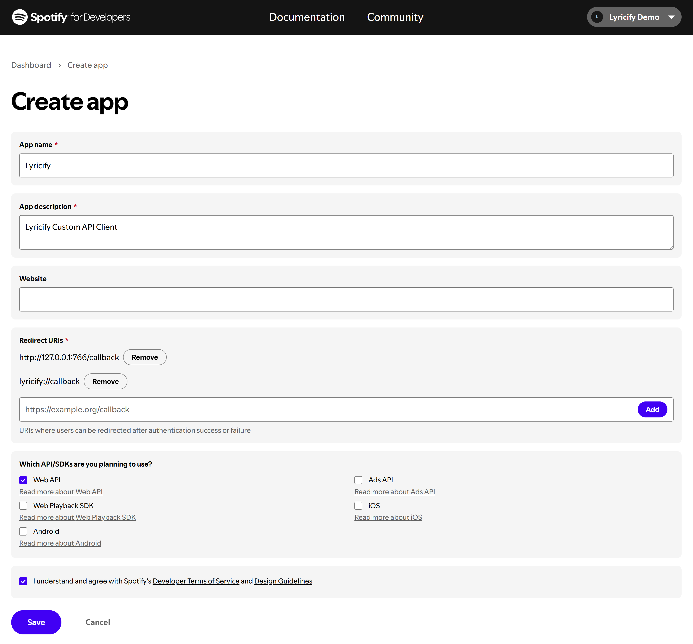
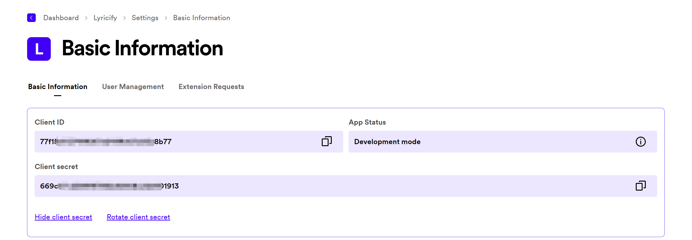

# 自定义 Spotify API Client 配置教程

## 自定义 Spotify API Client 的好处
不再会因 Spotify API 返回 429 错误而影响 Lyricify 使用体验。

## 准备步骤
如果你已经完成过准备步骤，则可以直接使用之前获得的 `Client ID` 和 `Client Secret`，在 `Lyricify Mobile 上的工作` 中使用。
1. 在浏览器中登录 Spotify (https://www.spotify.com) ，如果你已登录，可进入步骤 2。
2. 打开 https://developer.spotify.com/dashboard ，如果你是第一次打开这个网址，则需要先同意 Spotify Developer Terms。勾选下方的 `I accept the Spotify Developer Terms of Service`，再点击 `Accept the terms` 即可。

3. 点击 Dashboard 页面右上方的 `Create app`。

4. 在 Create app 页面中填写以下信息：
   - App name: Lyricify
   - App description: Lyricify Custom API Client
   - Website: （空着不写）
   - Redirect URI: http://localhost:766/callback
5. 勾选 `Which API/SDKs are you planning to use?` 部分中的 `Web API`；  
   勾选 `I understand and agree with Spotify's Developer Terms of Service and Design Guidelines`；  
   点击 `Save` 按钮。  

1. 点击右上方的 `Settings` 按钮，进入设置页面。
2. 这时你就能看到 Client ID，点击 `View client secret`，即可显示 Client secret。在后续步骤中将需要用到 `Client ID` 和 `Client Secret`。

## Lyricify Mobile 上的工作
1. 如果你已经在 Lyricify Mobile 中登录了 Spotify，则需要在打开 Lyricify Mobile 后，进入登录界面时点击 `取消`。
2. 在欢迎界面 `自定义 API Client` 区域对应处输入准备步骤中获取到的 `Client ID` 和 `Client Secret`。
3. 点击 `登录 (获取 Token)`，重新完成登录和授权即可。

# 常见问题

## 授权时提示 INVALID_CLIENT: Invalid redirect URI
请检查 `Redirect URI` 是否填写错误，确保其值包含 `http://localhost:766/callback`。