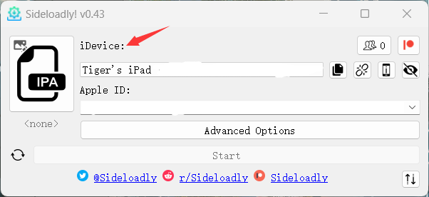
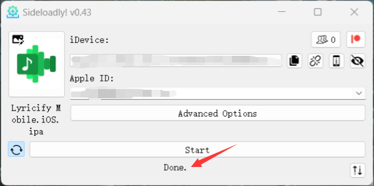

# Apple 设备自签教程 By [Tiger](https://github.com/mcuTiger)

## 前置准备
Lyricify Mobile iOS.ipa、[Sideloadly](https://sideloadly.io/#download)、iTunes、iCloud（iTunes、iCloud 可能需要非 Microsoft Store 版本）

## 步骤
1. 打开 Sideloadly，使用数据线将 iPhone / iPad 连接到您的 PC；点击 IPA 图标，选择安装软件。  
  
  注意事项：
    1. 第一次连接时，你的 iPhone / iPad 会提示是否信任此设备，选择信任即可；
    2. 连接成功后 iDevice 处会显示您的设备名称。
2. 在 Apple ID 处填写您的 Apple ID 信息；点击 Start 后，填写您的 Apple ID 密码进行验证（登录期间可能会弹出双重验证），签名成功后，程序会将 Lyricify Mobile 安装到你的设备上。  

3. 信任开发者 App；  

   然后打开您设备的开发者模式，然后重启你的 Apple 设备，并在开机后确认开启开发者模式。  

## 特别注意事项
如果在签名过程中报错（卡在步骤 2），请尝试以下方法：
1. 关掉 iTunes，从任务管理器关闭；
2. 进到 C:\ProgramData\Apple Computer\iTunes 文件夹；
3. 将 adi 文件夹更名为 adi.bak 或者直接删掉；
4. 重新打开软件进行签名即可。

## 其他注意事项
此方法只能解锁 7 天；但在 Sideloadly 运行时，将 Apple 设备接上您的 PC 后，App 期限将自动刷新。

## 隐私提示
此教程不保证您的账号安全，如果按照此教程进行 App 自签造成了不可预估的安全后果，则与该教程无关，敏感信息的输入和敏感操作是你自己独立完成的。
